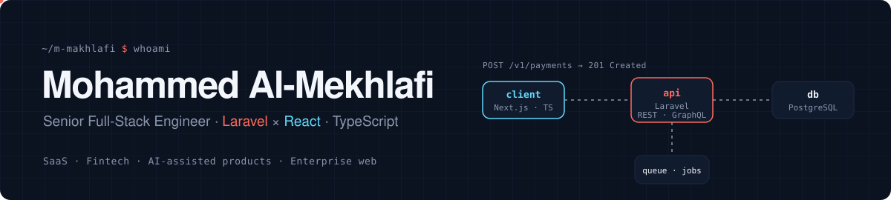
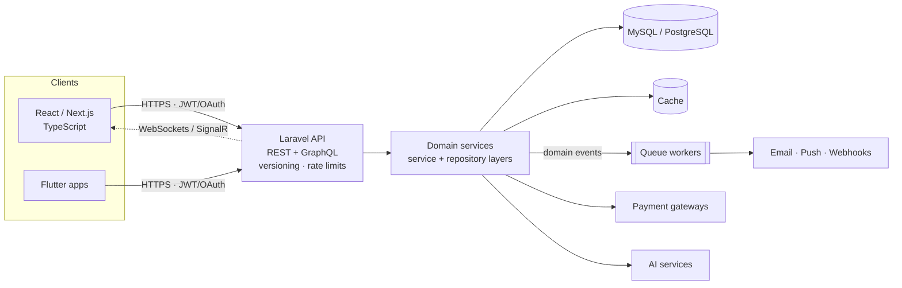
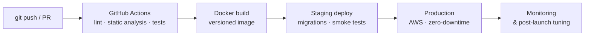
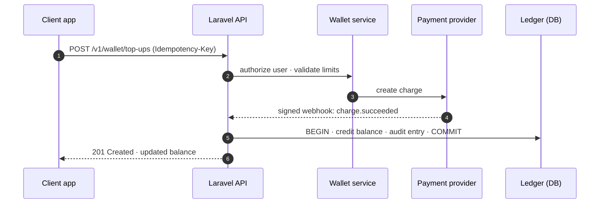
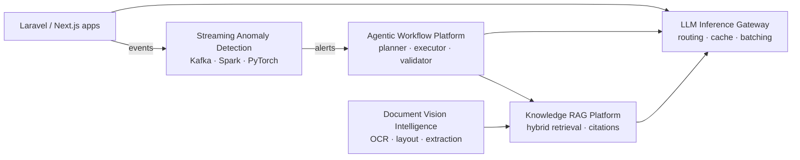

<!-- Header banner: source in .github/scripts/banners.mjs -->
<picture>
  <source media="(prefers-color-scheme: dark)" srcset="./assets/header-dark.svg">
  <source media="(prefers-color-scheme: light)" srcset="./assets/header-light.svg">
  
</picture>

<p align="center">
  <picture>
    <source media="(prefers-color-scheme: dark)" srcset="https://readme-typing-svg.demolab.com?font=JetBrains+Mono&weight=600&size=19&duration=2800&pause=900&color=61DAFB&center=true&vCenter=true&width=720&lines=Senior+Full-Stack+Engineer+%C2%B7+Laravel+%C3%97+React;Shipping+SaaS%2C+fintech+%26+AI-assisted+products;Laravel+backends+serving+100K%2B+API+requests+%2F+month;Payments+%C2%B7+wallets+%C2%B7+subscriptions+%C2%B7+RBAC;Building+AI+in+public%3A+RAG+%C2%B7+agents+%C2%B7+LLM+inference;Clean+Architecture+%C2%B7+domain+boundaries+%C2%B7+CI%2FCD">
    
  </picture>
</p>

<p align="center">
  
  
  
  
  
</p>

<p align="center">
  <a href="mailto:mohammed.r.almekhafi@gmail.com"></a>
  
  
  
</p>

<p align="center">
  
  
</p>

## `01` engineer.yaml

```yaml
engineer:
  name:        Mohammed Al-Mekhlafi
  role:        Senior Full-Stack Engineer
  experience:  2+ years   # production SaaS · fintech · e-commerce · enterprise
  education:   B.Sc. Information Technology — Sana'a University (2025)

stack:
  backend:     [PHP, Laravel, Node.js, REST, GraphQL]
  frontend:    [React, Next.js, TypeScript, Redux, Tailwind]
  data:        [MySQL, PostgreSQL, indexing, query-tuning]
  realtime:    [WebSockets, SignalR, Firebase Messaging]
  cloud_ops:   [AWS, Docker, GitHub Actions, Jenkins]

ai_engineering:   # building in public: see section 06
  genai:       [LLMs, RAG, AI agents, multi-agent systems, function calling, tool use, MCP, embeddings, vector search]
  ml:          [PyTorch, Hugging Face Transformers, scikit-learn, OpenCV, NLP, computer vision, anomaly detection]
  serving:     [FastAPI, quantization, TensorRT, ONNX, dynamic batching, model routing, semantic caching]
  data:        [pgvector, Elasticsearch, Kafka, Spark, Redis]
  mlops:       [MLflow, Kubernetes, Prometheus, Grafana, evaluation harnesses]

architecture:
  style:       modular monolith → clear domain boundaries
  patterns:    [MVC, Clean Architecture, service-layer, repository]
  api:         { versioning: true, rate_limiting: true, caching: true }
  async:       queues · jobs · event-driven workflows

security:      [OAuth, JWT, RBAC, encryption, audit-trails, GDPR, PCI-aware]
domains:       [payments, wallets, subscriptions, multi-tenant SaaS, AI recommendations]
languages:     { arabic: native, english: professional }
status:        open_to_senior_roles   # remote · onsite (KSA)
```

## `02` Impact at a glance

<table>
  <tr>
    <td align="center" width="25%"><h3>100K+</h3><sub>API requests / month served by Laravel &amp; Node.js backends</sub></td>
    <td align="center" width="25%"><h3>4</h3><sub>flagship products shipped: AI, fintech, devtools, content</sub></td>
    <td align="center" width="25%"><h3>3</h3><sub>senior tracks: full-stack, backend, frontend</sub></td>
    <td align="center" width="25%"><h3>2+</h3><sub>years delivering production systems end to end</sub></td>
  </tr>
</table>

## `03` What I do

- **End-to-end ownership.** Requirements → system design → data model → API → UI → CI/CD → post-launch optimization.
- **Backend that scales.** Modular Laravel & Node.js services with explicit domain boundaries; versioned REST & GraphQL APIs with rate limiting and caching; queues, jobs and event-driven pipelines for email, notifications and long-running work.
- **Fintech-grade features.** Payment gateways, digital wallets, subscriptions and role-based access control, built to be secure, auditable and reliable.
- **Frontend with discipline.** Component-driven React/Next.js + TypeScript, Redux/Context and custom hooks for complex state, WCAG-aware interfaces, real-time UX over WebSockets & SignalR.
- **Security & compliance.** OAuth/JWT, encryption, GDPR/PCI-aware data handling and audit trails for sensitive systems.
- **AI engineering, in public.** Building five production-style AI systems end to end: hybrid RAG, multi-agent automation, LLM inference optimization, document vision and streaming anomaly detection. Architecture, benchmarks and results published as they land.
- **Team multiplier.** Mentor junior and mid-level engineers, lead code reviews and architecture decisions, and keep Agile delivery predictable with product, design and QA.

## `04` How I build systems



<p align="center"><sub>Reference architecture used across my SaaS and fintech work.</sub></p>



<p align="center"><sub>Delivery pipeline I standardize on teams with GitHub Actions, Jenkins and Docker.</sub></p>

## `05` Featured products

<table>
  <tr>
    <td width="50%" valign="top">
      <h3>Major Match </h3>
      <p>AI-assisted platform that recommends university majors from student profiles, interests and performance. Bilingual (AR/EN) and analytics-driven.</p>
      <b>Engineering</b>
      <ul>
        <li>Laravel API orchestrating AI scoring services behind a clean service layer</li>
        <li>Flutter client with full RTL/LTR localization</li>
        <li>Analytics pipeline feeding admin dashboards</li>
      </ul>
      <p><code>Laravel</code> <code>AI services</code> <code>Flutter</code> <code>MySQL</code></p>
      <a href="https://github.com/m-makhlafi/major-match"><b>Case study →</b></a>
    </td>
    <td width="50%" valign="top">
      <h3>Easy Pay </h3>
      <p>Digital wallet and payments product: user balances, secure transaction handling and multiple payment providers behind one interface.</p>
      <b>Engineering</b>
      <ul>
        <li>Provider-agnostic gateway layer (one contract, many drivers)</li>
        <li>Balance changes inside DB transactions with a full audit trail</li>
        <li>Signed webhooks processed asynchronously via queues</li>
      </ul>
      <p><code>Laravel</code> <code>MySQL</code> <code>Queues</code> <code>Webhooks</code></p>
      <a href="https://github.com/m-makhlafi/easy-pay"><b>Case study →</b></a>
    </td>
  </tr>
  <tr>
    <td width="50%" valign="top">
      <h3>Migration Alchemy </h3>
      <p>Browser-based tool for managing Laravel migrations, built around developer workflow, conflict management and export flows.</p>
      <b>Engineering</b>
      <ul>
        <li>Visual schema and migration timeline in the browser</li>
        <li>Detects conflicting migrations before they reach <code>main</code></li>
        <li>Exports ready-to-run migration files</li>
      </ul>
      <p><code>TypeScript</code> <code>React</code> <code>Laravel</code></p>
      <a href="https://github.com/m-makhlafi/migration-alchemy"><b>Case study →</b></a>
    </td>
    <td width="50%" valign="top">
      <h3>Qurani </h3>
      <p>Content-focused Quran and Azkar application with wide distribution, built to run well on lower-end devices and in multiple languages.</p>
      <b>Engineering</b>
      <ul>
        <li>Small footprint and fast cold start on low-end Android</li>
        <li>Multilingual content with RTL-first layouts</li>
        <li>Firebase for messaging and remote configuration</li>
      </ul>
      <p><code>Flutter</code> <code>Firebase</code> <code>i18n</code></p>
      <a href="https://github.com/m-makhlafi/qurani"><b>Case study →</b></a>
    </td>
  </tr>
</table>

<details>
<summary><b>Payment flow — Easy Pay (simplified)</b></summary>



</details>

## `06` AI engineering — building in public

<p><sub>Five production-style AI systems I'm building end to end. Each repo publishes its architecture, full stack, measurable targets and a milestone roadmap first; code, benchmarks and results land as each milestone ships.</sub></p>

<table>
  <tr>
    <td width="50%" valign="top">
      <h3>Knowledge RAG Platform </h3>
      <p><b>Problem.</b> Reliable answers are buried in millions of Arabic and English documents spread across systems.</p>
      <p><b>Solution.</b> Hybrid RAG: document ingestion, semantic embeddings, BM25 retrieval, RRF fusion, cross-encoder reranking, metadata filtering, citation-aware LLM answer synthesis and an evaluation harness.</p>
      <p><b>Targets.</b> +31% retrieval relevance (nDCG@10) · ~70% faster time-to-answer · 1M+ queries / month</p>
      <p><code>Python</code> <code>PyTorch</code> <code>Hugging Face</code> <code>PostgreSQL + pgvector</code> <code>Elasticsearch</code> <code>vector databases</code> <code>LLM APIs</code> <code>FastAPI</code> <code>Kubernetes</code> <code>AWS</code> <code>Next.js</code></p>
      <a href="https://github.com/m-makhlafi/knowledge-rag-platform"><b>Architecture &amp; roadmap →</b></a>
    </td>
    <td width="50%" valign="top">
      <h3>Agentic Workflow Platform </h3>
      <p><b>Problem.</b> Complex business workflows force people to coordinate several systems by hand.</p>
      <p><b>Solution.</b> Multi-agent architecture with planner, retriever, executor, validator and human-escalation agents; permission-aware tool execution, structured agent state, MCP tools over Laravel APIs.</p>
      <p><b>Targets.</b> ~35% of targeted workflows automated · zero unapproved high-risk actions</p>
      <p><code>Python</code> <code>LLMs</code> <code>function calling</code> <code>tool use</code> <code>MCP</code> <code>FastAPI</code> <code>Redis</code> <code>PostgreSQL</code> <code>Kubernetes</code> <code>Laravel</code></p>
      <a href="https://github.com/m-makhlafi/agentic-workflow-platform"><b>Architecture &amp; roadmap →</b></a>
    </td>
  </tr>
  <tr>
    <td width="50%" valign="top">
      <h3>LLM Inference Gateway </h3>
      <p><b>Problem.</b> Generative AI brings high GPU costs and unpredictable latency.</p>
      <p><b>Solution.</b> Model-serving gateway with intelligent routing, exact + semantic caching, dynamic batching, quantization, KV-cache tuning, GPU scheduling and model-specific TensorRT / ONNX engines.</p>
      <p><b>Targets.</b> −61% p95 latency · +38% GPU utilization · −42% cost per request</p>
      <p><code>PyTorch</code> <code>CUDA</code> <code>TensorRT</code> <code>ONNX</code> <code>NVIDIA GPUs</code> <code>Kubernetes</code> <code>Redis</code> <code>Prometheus</code> <code>Grafana</code></p>
      <a href="https://github.com/m-makhlafi/llm-inference-gateway"><b>Architecture &amp; roadmap →</b></a>
    </td>
    <td width="50%" valign="top">
      <h3>Document Vision Intelligence </h3>
      <p><b>Problem.</b> Semi-structured Arabic/English documents are still processed by hand.</p>
      <p><b>Solution.</b> Computer-vision and document-intelligence pipeline: OpenCV pre-processing, object detection, OCR, layout analysis, transformer-based classification and structured extraction with human review.</p>
      <p><b>Targets.</b> +22% extraction accuracy (field F1) · ~60% less manual processing</p>
      <p><code>Python</code> <code>PyTorch</code> <code>OpenCV</code> <code>OCR</code> <code>Transformers</code> <code>FastAPI</code> <code>Kubernetes</code></p>
      <a href="https://github.com/m-makhlafi/document-vision-intelligence"><b>Architecture &amp; roadmap →</b></a>
    </td>
  </tr>
  <tr>
    <td colspan="2" valign="top">
      <h3>Streaming Anomaly Detection </h3>
      <p><b>Problem.</b> Abnormal transaction and system behavior is detected hours too late. <b>Solution.</b> Streaming ML architecture: Laravel events → Kafka, Spark streaming feature generation, Redis online feature store, PyTorch + Isolation Forest scoring, real-time alerting, analyst feedback and MLflow retraining.</p>
      <p><b>Targets.</b> Detection in under one minute · +27% precision vs. rule-based baseline</p>
      <p><code>Python</code> <code>Kafka</code> <code>Spark</code> <code>Redis</code> <code>PyTorch</code> <code>scikit-learn</code> <code>MLflow</code> <code>Kubernetes</code></p>
      <a href="https://github.com/m-makhlafi/streaming-anomaly-detection"><b>Architecture &amp; roadmap →</b></a>
    </td>
  </tr>
</table>



<p align="center"><sub>How the five systems fit together: one gateway for every model call, agents grounded in RAG, documents flowing into the knowledge base, anomalies triggering agent workflows.</sub></p>

<details>
<summary><b>AI engineering stack</b></summary>

| Area | Technologies |
| --- | --- |
| AI & machine learning | Deep learning, machine learning, NLP, computer vision, recommendation systems, ranking, classification, forecasting, anomaly detection, multimodal AI |
| Generative AI & LLMs | LLMs, RAG, agentic AI, AI agents, prompt engineering, function calling, tool use, fine-tuning, LoRA / QLoRA, evaluation frameworks, embeddings, vector search, knowledge graphs |
| Programming | Python, PHP, TypeScript, JavaScript, SQL, Bash |
| Frameworks & libraries | PyTorch, TensorFlow, Hugging Face Transformers, scikit-learn, OpenCV, LangChain, LlamaIndex, FastAPI |
| Cloud & infrastructure | AWS, Google Cloud, Azure, Kubernetes, Docker, Terraform, Linux, GPU infrastructure, Kafka, Redis |
| MLOps & deployment | MLflow, CI/CD, model registry, feature stores, model monitoring, A/B testing, model serving, quantization, TensorRT, ONNX |
| Data engineering | Spark, PostgreSQL, pgvector, Elasticsearch, data lakes, ETL / ELT, streaming pipelines |
| AI architecture | Model serving, inference optimization, multi-agent systems, RAG architecture, high-availability systems, security & governance |

</details>

<p align="center">
  
</p>

## `07` Experience

| Role | Company | Focus |
| --- | --- | --- |
| **Senior Software Engineer**<br/><sub>Full Stack & Web Applications</sub> | Remote / Onsite | Led enterprise web projects end to end · backends at 100K+ req/month · payments, wallets, subscriptions, RBAC · CI/CD with GitHub Actions, Jenkins, Docker · mentoring |
| **Senior Laravel Backend Developer** | Limitstech | REST & GraphQL APIs with versioning, rate limiting, caching · MySQL/PostgreSQL schema design & indexing · queues and event-driven jobs · reusable Laravel packages |
| **Senior Frontend React.js Developer** | jusim | React + TypeScript + Redux component architecture · Tailwind & Styled Components · WCAG accessibility · real-time features via WebSockets & SignalR |

## `08` Tech stack

<p align="center"><b>Backend &amp; APIs</b><br/>
  
</p>
<p align="center"><b>Frontend</b><br/>
  
</p>
<p align="center"><b>Data, cloud &amp; DevOps</b><br/>
  
</p>
<p align="center"><b>Mobile &amp; tools</b><br/>
  
</p>

## `09` Engineering principles

| Principle | What it looks like in my code |
| --- | --- |
| **Boundaries first** | Service and repository layers, modular monolith before microservices, domain logic kept out of controllers |
| **Secure by default** | OAuth/JWT, least-privilege RBAC, encrypted sensitive fields, audit logs on money movement |
| **Measure, then optimize** | Query plans and indexing, caching hot reads, moving slow work to queues |
| **Ship small, ship often** | CI on every PR, Dockerized environments, automated build → test → deploy |
| **Built for everyone** | WCAG-aware components and RTL/LTR layouts for Arabic and English users |

## `10` GitHub analytics

<p align="center">
  <picture>
    <source media="(prefers-color-scheme: dark)" srcset="https://raw.githubusercontent.com/m-makhlafi/m-makhlafi/output/stats-dark.svg">
    
  </picture>
  <picture>
    <source media="(prefers-color-scheme: dark)" srcset="https://raw.githubusercontent.com/m-makhlafi/m-makhlafi/output/langs-dark.svg">
    
  </picture>
  <picture>
    <source media="(prefers-color-scheme: dark)" srcset="https://raw.githubusercontent.com/m-makhlafi/m-makhlafi/output/streak-dark.svg">
    
  </picture>
</p>
<p align="center"><sub>Self-hosted cards regenerated daily by a GitHub Action (<code>.github/scripts/stats.mjs</code>).</sub></p>

## `11` Contribution stream

<picture>
  <source media="(prefers-color-scheme: dark)" srcset="https://raw.githubusercontent.com/m-makhlafi/m-makhlafi/output/snake-dark.svg">
  
</picture>

<picture>
  <source media="(prefers-color-scheme: dark)" srcset="./assets/footer-dark.svg">
  <source media="(prefers-color-scheme: light)" srcset="./assets/footer-light.svg">
  
</picture>
